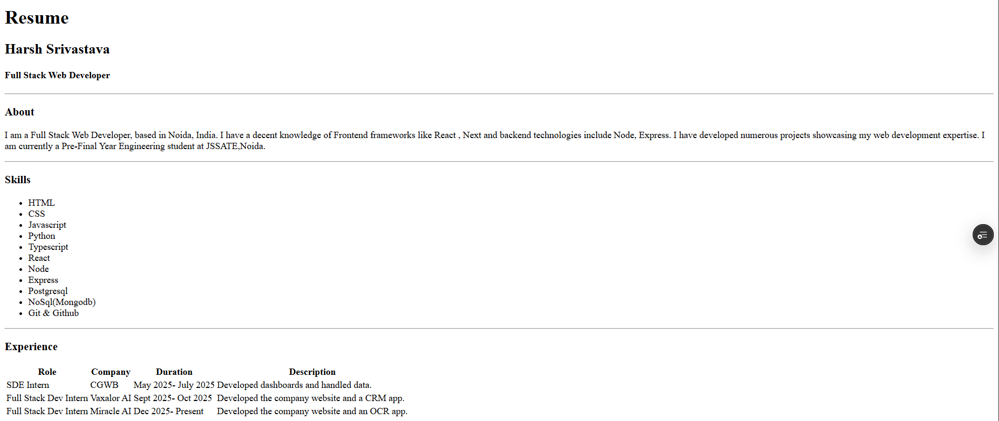
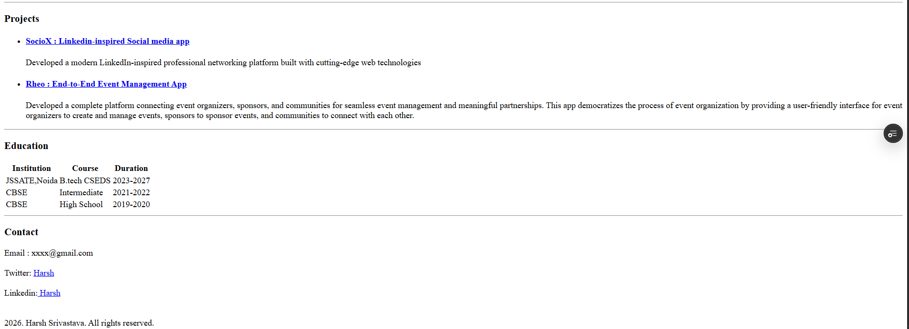

# Resume - Harsh Srivastava

A clean and professional HTML resume showcasing my experience, skills, projects, and education as a Full Stack Web Developer.

##  Demo

**Live Link:** https://resume-amber-mu.vercel.app/
**Local Demo:** Open `Resume.html` in any modern web browser

##  Features

- **Responsive Design**: Clean and structured layout
- **Semantic HTML**: Proper use of HTML5 semantic elements
- **Professional Sections**:
  - About Me
  - Technical Skills
  - Work Experience
  - Projects with Live Links
  - Education
  - Contact Information
- **Well-organized Content**: Easy to read and navigate
- **Accessible Links**: Direct links to projects and social profiles

##  Setup Instructions

### Prerequisites
- Any modern web browser (Chrome, Firefox, Safari, Edge)
- No additional dependencies required

### Steps to Run Locally

1. **Clone or Download the Repository**
   ```bash
   git clone https://github.com/HarshS16/HTML
   ```

2. **Open the HTML File**
   - Option 1: Double-click on `Resume.html` to open in your default browser
   - Option 2: Right-click `Resume.html` → Open with → Choose your preferred browser
   - Option 3: Drag and drop `Resume.html` into an open browser window

3. **View the Resume**
   - The resume will display immediately in your browser
   - No server setup or build process required

## Usage

### Viewing Locally
Simply open the `Resume.html` file in any web browser to view the complete resume.

##  Technologies Used

- **HTML5**: Semantic markup for structured content
- **Tables**: For organized display of experience and education
- **Lists**: For skills and projects
- **Hyperlinks**: For project demos and social profiles

## 📸 Screenshots


## 📝 License

© 2026. Harsh Srivastava. All rights reserved.

---